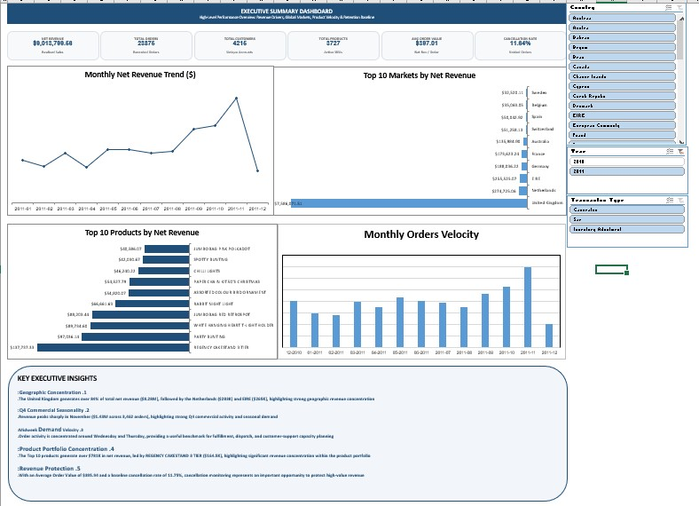
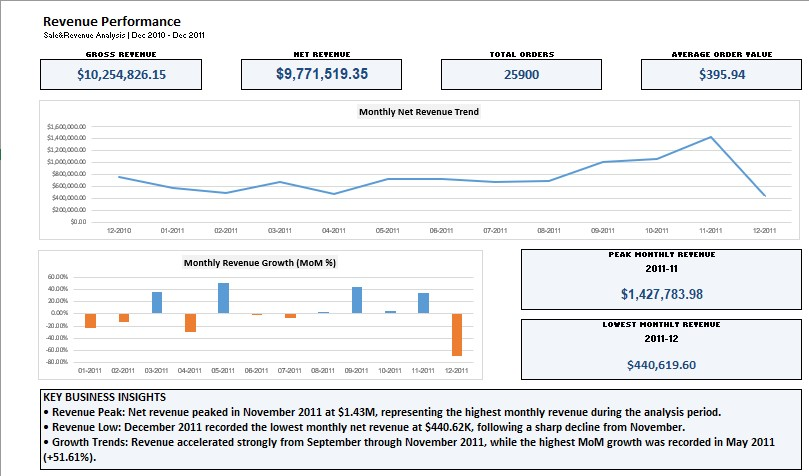
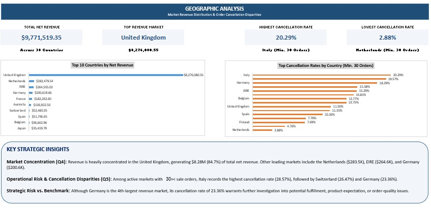
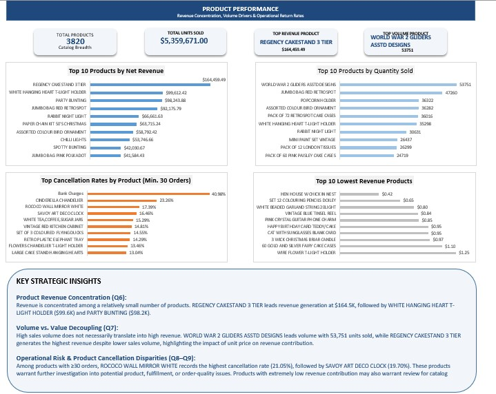
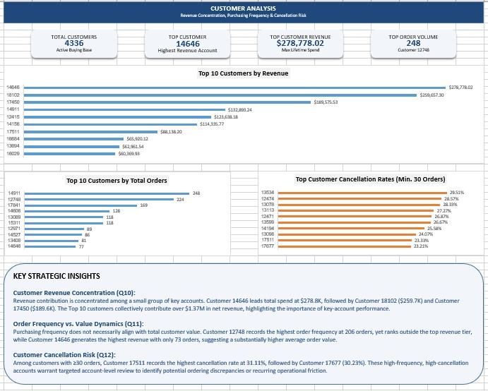
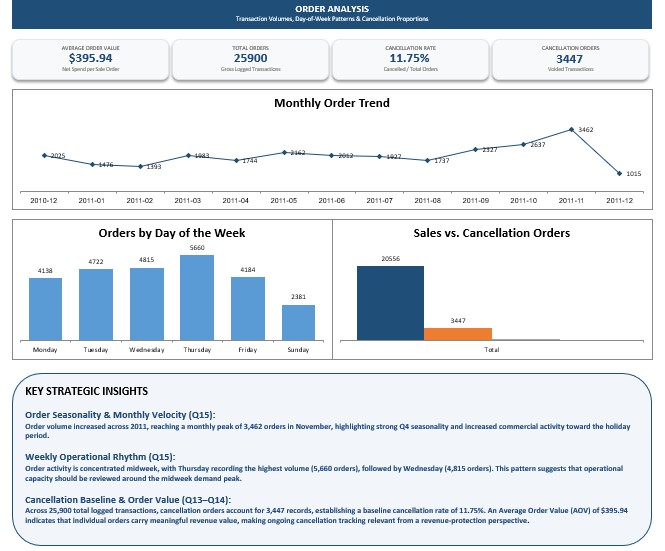

# 📊 Online Retail Sales Analysis (Excel)


An end-to-end Excel Business Intelligence project that transforms the Kaggle Online Retail Dataset into an auditable data model, interactive dashboards, and actionable commercial insights.

**Status: ✅ Completed**

| Project detail | Description |
|---|---|
| **Dataset** | Online Retail Dataset from Kaggle |
| **Source size** | 541,910 rows and 8 columns |
| **Analysis period** | December 2010 – December 2011 |
| **Processed output** | 536,641 cleaned transaction rows |
| **Primary tools** | Microsoft Excel 2021, Power Query, Pivot Tables, Pivot Charts, and DAX |

---

## 📑 Table of Contents

- [Project Objective](#-project-objective)
- [Project Status](#-project-status)
- [Downloads](#-downloads)
- [Dashboard Preview](#-dashboard-preview)
- [Verified KPI Snapshot](#-verified-kpi-snapshot)
- [KPI Definition Notes](#-kpi-definition-notes)
- [Key Insights](#-key-insights)
- [Recommendations](#-recommendations)
- [Technical Stack](#️-technical-stack)
- [Project Workflow](#-project-workflow)
- [Repository Structure](#-repository-structure)
- [Documentation](#-documentation)
- [Data Limitations](#️-data-limitations)
- [Author](#-author)
- [License](#-license)

---

## 🎯 Project Objective

Build a reliable, executive-ready sales analysis solution from raw transaction data. The project covers data quality assessment, Power Query transformation, semantic classification, DAX KPI development, exploratory analysis, and dashboard storytelling.

The resulting workbook helps business users understand revenue performance, geographic concentration, product demand, customer value, order timing, and cancellations through interactive views and slicers.

---

## ✅ Project Status

This project is complete and ready for portfolio review.

- ✅ Business requirements and analytical questions defined
- ✅ Raw data profiled and quality assessed
- ✅ Data cleaned, typed, deduplicated, and classified in Power Query
- ✅ Power Pivot data model and DAX measures developed
- ✅ KPI calculations validated against the source data
- ✅ Dashboard pages and interactive visuals completed
- ✅ Business insights and recommendations documented
- ✅ Final workbook and processed dataset published through GitHub Releases

---

## 📥 Downloads

| Resource | Description | Size | Download |
|---|---|---|:---:|---|
| **Sales Performance Workbook (v1.1)** | Excel workbook with the complete data model and full interactive dashboard | 56 MB | [Download](https://github.com/ebramrafat653-wq/online-retail-sales-analysis-excel/releases/download/v1.1-workbook/Sales_Performance_Analysis.xlsx) |
| **Processed Dataset (v1.1)** | Cleaned CSV containing 536K processed transaction rows | 83 MB | [Download](https://github.com/ebramrafat653-wq/online-retail-sales-analysis-excel/releases/download/v1.1-data/online_retail_processed.csv) |

> 📌 The workbook and dataset are hosted as GitHub Releases because they exceed the standard Git file size limit. This keeps the repository lightweight and fast to clone.

---

## 📸 Dashboard Preview

| Executive Summary | Revenue Performance |
|---|---|
|  |  |

| Geographic Analysis | Product Performance |
|---|---|
|  |  |

| Customer Analysis | Order Analysis |
|---|---|
|  |  |

---

## 📈 Verified KPI Snapshot

| KPI | Value |
|---|---:|
| **Gross revenue** | **$10,254,826.15** |
| **Net revenue** | **$9,771,519.35** |
| **Total recorded invoices** | **25,900** |
| **Sale orders** | **20,556** |
| **Cancellation orders** | **3,447** |
| **Non-product invoices** | **1,897** |
| **Identified transacting customers** | **4,336** |
| **Active product SKUs** | **3,820** |
| **Average order value** | **$395.94** |
| **Baseline cancellation rate** | **11.75%** |

---

## 🧮 KPI Definition Notes

Some KPIs use non-standard but explicitly documented formulas to reflect the transaction classification model accurately.

| KPI | Formula | Notes |
|---|---|---|
| **Gross Revenue** | `SUM(Revenue) WHERE AnalysisType = "Sale"` | Product sales only |
| **Net Revenue** | `SUM(Revenue) WHERE AnalysisType <> "Non-Product"` | Includes signed cancellations |
| **Total Recorded Invoices** | `DISTINCTCOUNT(InvoiceNo)` | All transaction types |
| **Sale Orders** | `DISTINCTCOUNT(InvoiceNo) WHERE AnalysisType = "Sale"` | Product sales only |
| **Cancellation Orders** | `DISTINCTCOUNT(InvoiceNo) WHERE AnalysisType = "Cancellation"` | InvoiceNo starting with "C" |
| **Average Order Value** | `Gross Revenue ÷ Total Recorded Invoices` | Revenue per recorded invoice |
| **Cancellation Rate** | `Cancellation Orders ÷ (Total Recorded Invoices + Cancellation Orders)` | Custom transaction-monitoring KPI |

> ⚠️ **Cancellation Rate** is **not** the percentage of revenue lost. It is a transaction-identifier-level indicator based on the model's classification logic.

---

## 🔍 Key Insights

### 1. 🌟 Revenue is strongly seasonal

November is the observed revenue peak at approximately **$1.43M**, with demand accelerating into the holiday period. December remains strategically important for inventory, fulfillment, and campaign planning.

### 2. 🌍 The United Kingdom is the core market

The UK contributes approximately **$8.28M**, or **84.7% of net revenue**. The top five markets together represent **93.2%**, indicating a highly concentrated geographic footprint across 38 countries.

### 3. 📦 A focused group of giftware SKUs drives product revenue

The product view shows revenue concentrated in a relatively small set of repeat-purchase giftware lines. **REGENCY CAKESTAND 3 TIER** leads revenue generation at **$164,469.49**, while **WORLD WAR 2 GLIDERS ASSTD DESIGNS** leads unit volume at **53,751 units** — highlighting the impact of unit price on revenue contribution.

### 4. ⚠️ Cancellations create a material operational leakage point

There are **3,447 cancellation orders**, producing a baseline cancellation rate of **11.75%**. Monitoring cancellation patterns by month, country, and product can help reduce avoidable revenue loss.

### 5. 👥 Customer value is concentrated in a high-value cohort

**Customer 14646** leads total spend at **$278,778.02**, followed by **Customer 18102** ($259,657.30) and **Customer 17450** ($189,587.53). The top 10 customers collectively contribute over **$1.37M** in net revenue, highlighting the importance of key-account performance.

### 6. 🕐 Ordering activity is strongest during business-week operating windows

**Thursday** shows the highest order volume at **5,860 orders**, followed by **Wednesday (4,815)**. Together, **Wednesday and Thursday account for ~38.4% of weekly order volume**, creating a practical baseline for staffing, fulfillment capacity, and customer-service coverage.

### 7. 📈 Month-over-month performance follows campaign and holiday momentum

Monthly revenue builds toward the fourth quarter rather than growing evenly across the year. The highest MoM growth was recorded in **May 2011 (+51.61%)**, while the peak month was **November 2011 ($1,427,783.98)**. The lowest month was **December 2011 ($440,619.60)**.

---

## 💡 Recommendations

1. **Plan holiday inventory earlier:** Use the November peak as a planning trigger, increasing stock coverage and fulfillment capacity before Q4 demand accelerates.

2. **Protect the UK base while diversifying selectively:** Maintain localized UK campaigns and service levels while testing focused acquisition programs in the next-highest-value European markets (Netherlands, EIRE, Germany).

3. **Prioritize high-performing SKUs:** Set replenishment thresholds and promotional budgets around the leading revenue-generating giftware products, while reviewing slow-moving items for rationalization.

4. **Create a cancellation-reduction workflow:** Track cancellation rate by product, country, and month; investigate recurring causes such as stockouts, fulfillment delays, and order-entry errors. Italy's 20.29% cancellation rate warrants dedicated investigation.

5. **Develop a high-value customer program:** Segment the top customer cohort for retention outreach, personalized bundles, early access, and repeat-purchase incentives.

6. **Align operational capacity with weekly demand rhythm:** Concentrate staffing, fulfillment, and customer-service resources around Wednesday–Thursday peak windows.

---

## 🛠️ Technical Stack

- **Microsoft Excel 2021**
- **Power Query** using the M language for ETL and data quality transformations
- **Power Pivot / DAX** for the analytical data model and KPI measures
- **Pivot Tables and Pivot Charts** for interactive analysis
- **Git and GitHub** for version control and project delivery
- **GitHub Releases** for hosting large workbook and dataset files

---

## 📊 Project Workflow

✅ Business Understanding → ✅ Data Understanding → ✅ Data Quality Assessment → ✅ Data Cleaning → ✅ EDA → ✅ KPI Development → ✅ Dashboard → ✅ Insights → ✅ Recommendations

---

## 📂 Repository Structure

```text
online-retail-sales-analysis-excel/
├── .gitignore
├── README.md
├── data/
│   ├── raw/                         # Original Kaggle dataset
│   └── processed/                   # Large files → see Releases
├── docs/
│   ├── Project Documentation.md
│   ├── data_dictionary.md
│   ├── dax_measures.md
│   ├── power_query_logic.md
│   └── validation_report.md
├── excel/
│   ├── workbook/                    # Large files → see Releases
│   └── exports/
└── images/
    ├── Executive_Summary_00.jpg
    ├── Revenue_Performance_01.jpg
    ├── Geographic_Analysis_02.jpg
    ├── Product_Performance_03.jpg
    ├── Customer_Analysis_04.jpg
    └── Order_Analysis_05.jpg
```

---

## 📚 Documentation

| Document | Description |
|---|---|
| [Project Documentation](<docs/Project Documentation.md>) | End-to-end project guide covering business context, analysis, and conclusions |
| [Data Dictionary](docs/data_dictionary.md) | Definitions for source and engineered columns |
| [DAX Measures](docs/dax_measures.md) | KPI formulas, definitions, and calculation caveats |
| [Power Query Logic](docs/power_query_logic.md) | M-language transformation and classification logic |
| [Validation Report](docs/validation_report.md) | Data integrity checks, metric reconciliation, and semantic audit |

---

## ⚠️ Data Limitations

- The dataset covers a single 13-month period and does not include cost of goods sold. Financial results therefore represent **realized revenue** rather than profit.
- Cancellation Rate is a **transaction-identifier-level indicator**, not a revenue-loss percentage.
- The 30-invoice threshold used in country-level cancellation rankings is an analytical screening rule, not a formal statistical-significance threshold.
- The findings are descriptive for the observed period and should not be treated as multi-year forecasts without additional history.

---

## 👤 Author

**[Ebram Rafat]**

- 🐙 GitHub: [@ebramrafat653-wq](https://github.com/ebramrafat653-wq)
- 💼 LinkedIn: [Ebram Rafat](https://www.linkedin.com/in/ebram-rafat-b9418132b)
- 📧 Email: ebramrafat569@gmail.com

---

## 📄 License

This project is created for **portfolio and educational purposes**. The dataset remains the property of its original provider and is used in accordance with applicable source terms.

---

## 🏷️ Tags / Topics

`excel` `data-analysis` `power-query` `dax` `dashboard` `business-intelligence` `retail-analytics` `portfolio-project`