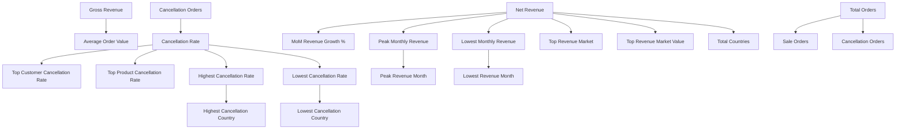

# DAX Measures Documentation

## Online Retail Sales Analysis – Excel Data Model

---

## 1. Purpose

This document describes the DAX measures implemented in the Excel Power Pivot data model for the **Online Retail Sales Analysis** project.

The measures operate on the transformed `online_retail` table produced by Power Query and use `AnalysisType` as the primary analytical filter for product sales, cancellation, and non-product activity.

The measures are used across the project's analytical sheets and the `Executive_Summary_00` dashboard.

---

## 2. Analytical Model Context

The Power Query layer creates the following core analytical classifications:

* `TransactionType`

  * `Sale`
  * `Cancellation`
  * `Inventory Adjustment`

* `ItemType`

  * `Product`
  * `Non-Product`

* `AnalysisType`

  * `Sale`
  * `Cancellation`
  * `Non-Product`

### Important implementation detail

Although `TransactionType` contains `Inventory Adjustment`, the final `AnalysisType` logic maps inventory-adjustment records to `Non-Product`.

Therefore:

> `TransactionType` should be used when specifically analyzing Inventory Adjustments.

> `AnalysisType` should be used for the main Sale / Cancellation / Non-Product analytical filtering.

---

## 3. Core KPI Measures

### 3.1 Gross Revenue

**Definition**

Total revenue generated from product transactions classified as `Sale`.

**DAX**

```dax
Gross Revenue :=
CALCULATE(
    SUM(online_retail[Revenue]),
    online_retail[AnalysisType] = "Sale"
)
```

**Business Meaning**

Measures realized revenue from product sales only.

**Caveat**

This measure excludes:

* Cancellation transactions
* Inventory-adjustment records
* Non-product records

It is therefore different from the broader `[Net Revenue]` measure.

---

### 3.2 Total Recorded Invoices

**Definition**

Number of distinct `InvoiceNo` identifiers across all transaction types.

**DAX**

```dax
Total Orders :=
DISTINCTCOUNT(online_retail[InvoiceNo])
```

**Business Meaning**

Represents the total number of recorded invoice identifiers in the model.

**Important semantic note**

Although the measure is named `Total Orders` in the workbook, the underlying unit is a distinct `InvoiceNo` identifier. Because the dataset contains cancellations and adjustment-related transactions, the metric is more precisely described as:

> **Total Recorded Invoices**

For documentation purposes, `Total Recorded Invoices` is the preferred semantic label.

---

### 3.3 Total Customers

**Definition**

Number of unique identified customers associated with product sales.

**DAX**

```dax
Total Customers :=
CALCULATE(
    DISTINCTCOUNT(online_retail[CustomerID]),
    online_retail[AnalysisType] = "Sale",
    NOT(ISBLANK(online_retail[CustomerID]))
)
```

**Business Meaning**

Measures the number of identified transacting customer accounts represented in product sales.

**Caveat**

Rows with missing or blank `CustomerID` are excluded from this metric.

The metric therefore represents:

> **Identified Transacting Customers**

rather than every customer-related record in the raw dataset.

---

### 3.4 Total Products

**Definition**

Number of distinct product SKUs appearing in product-sales transactions.

**DAX**

```dax
Total Products :=
CALCULATE(
    DISTINCTCOUNT(online_retail[StockCode]),
    online_retail[AnalysisType] = "Sale"
)
```

**Business Meaning**

Measures the breadth of the active product portfolio represented by actual product sales.

**Caveat**

The metric counts distinct `StockCode` values within `AnalysisType = "Sale"`.

It should therefore be interpreted as:

> **Distinct product SKUs associated with Sale-classified product transactions**

rather than a formal product-master count.

---

### 3.5 Average Order Value

**Definition**

Gross product-sales revenue divided by total recorded invoice identifiers.

**DAX**

```dax
Average Order Value :=
DIVIDE(
    [Gross Revenue],
    [Total Orders]
)
```

**Business Meaning**

Provides an average revenue-per-recorded-invoice indicator.

**Important semantic note**

The numerator uses:

```text
Gross Revenue
```

while the denominator uses:

```text
Total Orders
```

which includes all distinct invoice identifiers.

Therefore, the current measure is more precisely interpreted as:

> **Gross Sales Revenue per Recorded Invoice**

rather than a conventional sales-only AOV.

**Current verified value**

`$395.94`

---

### 3.6 Cancellation Rate

**Definition**

Cancellation invoice identifiers divided by total recorded invoice identifiers plus cancellation invoice identifiers.

**DAX**

```dax
Cancellation Rate :=
DIVIDE(
    [Cancellation Orders],
    [Total Orders] + [Cancellation Orders]
)
```

**Business Meaning**

Provides a transaction-level cancellation monitoring indicator.

**Current verified value**

`11.75%`

**Important semantic note**

This is **not**:

* percentage of revenue lost;
* percentage of profit lost;
* percentage of physical units returned;
* financial loss percentage.

It is a transaction-identifier-level cancellation indicator based on the model's current denominator.

---

## 4. Transaction & Revenue Measures

### 4.1 Sale Orders

**Definition**

Number of distinct invoices classified as product sales.

**DAX**

```dax
Sale Orders :=
CALCULATE(
    DISTINCTCOUNT(online_retail[InvoiceNo]),
    online_retail[AnalysisType] = "Sale"
)
```

**Business Meaning**

Provides a sales-only invoice count without cancellation and non-product records.

**Use**

Recommended when the analysis requires an actual product-sales invoice count.

---

### 4.2 Cancellation Orders

**Definition**

Number of distinct invoice identifiers classified as cancellations.

**DAX**

```dax
Cancellation Orders :=
CALCULATE(
    DISTINCTCOUNT(online_retail[InvoiceNo]),
    online_retail[AnalysisType] = "Cancellation"
)
```

**Business Meaning**

Measures the number of invoice identifiers classified as cancellation transactions.

**Use**

Supports cancellation monitoring and cancellation-rate analysis.

---

### 4.3 Cancellation Revenue

**Definition**

Signed revenue associated with cancellation-classified transactions.

**DAX**

```dax
Cancellation Revenue :=
CALCULATE(
    SUM(online_retail[Revenue]),
    online_retail[AnalysisType] = "Cancellation"
)
```

**Business Meaning**

Measures the revenue value associated with cancellation transactions.

**Important caveat**

The underlying `Revenue` measure is signed:

```text
Quantity × UnitPrice
```

Therefore cancellation revenue may be negative.

This measure does **not** apply `ABS()` and should not be described as an absolute cancellation-value measure.

---

### 4.4 Inventory Adjustment Transactions

**Definition**

Intended to measure rows classified as inventory adjustments.

**Current DAX**

```dax
Inventory Adjustment Transactions :=
CALCULATE(
    COUNTROWS(online_retail),
    online_retail[AnalysisType] = "Inventory Adjustment"
)
```

**Implementation caveat**

The current Power Query logic does not create an `AnalysisType = "Inventory Adjustment"` value.

Instead:

* `TransactionType = "Inventory Adjustment"` exists;
* the final `AnalysisType` maps such records to `Non-Product`.

Therefore, this measure does not currently isolate inventory adjustments through `AnalysisType`.

For inventory-adjustment analysis, the source classification is:

```text
TransactionType = "Inventory Adjustment"
```

This limitation is documented rather than silently corrected.

---

### 4.5 Total Quantity Sold

**Definition**

Total unit quantity associated with product sales.

**DAX**

```dax
Total Quantity Sold :=
CALCULATE(
    SUM(online_retail[Quantity]),
    online_retail[AnalysisType] = "Sale"
)
```

**Business Meaning**

Measures the physical unit volume associated with product sales.

**Use**

Supports volume-versus-revenue analysis and product performance reporting.

---

### 4.6 Net Quantity Sold

**Definition**

Net quantity movement across product-classified sales and cancellations.

**DAX**

```dax
Net Quantity Sold :=
CALCULATE(
    SUM(online_retail[Quantity]),
    online_retail[AnalysisType] <> "Non-Product"
)
```

**Business Meaning**

Provides a net unit view after including negative cancellation quantities.

**Caveat**

Because negative quantities can be present in cancellation-related records, this measure should not be interpreted as gross units sold.

---

## 5. Revenue & Growth Measures

### 5.1 Net Revenue

**Definition**

Revenue from all records that are not classified as `Non-Product`.

**DAX**

```dax
Net Revenue :=
CALCULATE(
    SUM(online_retail[Revenue]),
    online_retail[AnalysisType] <> "Non-Product"
)
```

**Business Meaning**

This is the project's core revenue KPI and includes:

* Product Sales
* Product Cancellations

Because cancellation revenue is signed, cancellation lines can reduce the resulting aggregate.

**Caveat**

The measure excludes records classified as `Non-Product`.

It is therefore best described as:

> **Net realized product revenue after signed cancellation activity, excluding Non-Product records.**

---

### 5.2 Positive Net Revenue

**Definition**

Returns `[Net Revenue]` when the result is positive; otherwise returns blank.

**DAX**

```dax
Positive Net Revenue :=
VAR CurrentRevenue = [Net Revenue]
RETURN
    IF(
        CurrentRevenue > 0,
        CurrentRevenue,
        BLANK()
    )
```

**Business Meaning**

Presentation helper used when negative values would create undesirable chart or display behavior.

**Caveat**

This is a visualization-oriented helper and should not replace `[Net Revenue]` for financial analysis.

---

### 5.3 MoM Revenue Growth %

**Definition**

Month-over-Month percentage change in `[Net Revenue]`.

**DAX**

```dax
MoM Revenue Growth % :=
VAR PreviousYearMonth =
    FORMAT(
        EDATE(
            DATE(
                MAX(online_retail[Year]),
                MAX(online_retail[MonthNumber]),
                1
            ),
            -1
        ),
        "yyyy-MM"
    )

VAR CurrentRevenue =
    [Net Revenue]

VAR PreviousRevenue =
    CALCULATE(
        [Net Revenue],
        ALL(
            online_retail[Year],
            online_retail[MonthNumber],
            online_retail[YearMonth]
        ),
        online_retail[YearMonth] = PreviousYearMonth
    )

RETURN
    IF(
        ISBLANK(PreviousRevenue),
        BLANK(),
        DIVIDE(
            CurrentRevenue - PreviousRevenue,
            PreviousRevenue
        )
    )
```

**Business Meaning**

Measures monthly revenue momentum relative to the immediately preceding month.

**Caveat**

Returns blank when a previous comparison period does not exist.

---

### 5.4 Peak Monthly Revenue

**Definition**

Highest `[Net Revenue]` across all available months.

**DAX**

```dax
Peak Monthly Revenue :=
MAXX(
    ALL(online_retail[YearMonth]),
    [Net Revenue]
)
```

**Business Meaning**

Identifies the strongest monthly revenue value.

---

### 5.5 Peak Revenue Month

**Definition**

The `YearMonth` associated with `[Peak Monthly Revenue]`.

**DAX**

```dax
Peak Revenue Month :=
VAR MaxRev =
    [Peak Monthly Revenue]

RETURN
    CALCULATE(
        FIRSTNONBLANK(
            online_retail[YearMonth],
            1
        ),
        FILTER(
            ALL(online_retail[YearMonth]),
            [Net Revenue] = MaxRev
        )
    )
```

**Business Meaning**

Identifies the month associated with the highest revenue value.

---

### 5.6 Lowest Monthly Revenue

**Definition**

Lowest `[Net Revenue]` across all available months.

**DAX**

```dax
Lowest Monthly Revenue :=
MINX(
    ALL(online_retail[YearMonth]),
    [Net Revenue]
)
```

**Business Meaning**

Identifies the weakest monthly revenue value.

---

### 5.7 Lowest Revenue Month

**Definition**

The `YearMonth` associated with `[Lowest Monthly Revenue]`.

**DAX**

```dax
Lowest Revenue Month :=
VAR MinRev =
    [Lowest Monthly Revenue]

RETURN
    CALCULATE(
        FIRSTNONBLANK(
            online_retail[YearMonth],
            1
        ),
        FILTER(
            ALL(online_retail[YearMonth]),
            [Net Revenue] = MinRev
        )
    )
```

**Business Meaning**

Identifies the month associated with the lowest revenue value.

---

## 6. Geographic Measures

### 6.1 Total Countries

**Definition**

Number of distinct countries associated with Product-related transactions.

**DAX**

```dax
Total Countries :=
CALCULATE(
    DISTINCTCOUNT(online_retail[Country]),
    online_retail[AnalysisType] <> "Non-Product"
)
```

**Business Meaning**

Measures the analytical geographic footprint represented by product sales and cancellations.

---

### 6.2 Top Revenue Market

**Definition**

Country producing the highest `[Net Revenue]`.

**DAX**

```dax
Top Revenue Market :=
VAR CountryRevenue =
    ADDCOLUMNS(
        ALL(online_retail[Country]),
        "@Revenue",
            CALCULATE([Net Revenue])
    )

RETURN
    MAXX(
        TOPN(
            1,
            CountryRevenue,
            [@Revenue], DESC,
            online_retail[Country], ASC
        ),
        online_retail[Country]
    )
```

**Business Meaning**

Identifies the leading revenue market.

---

### 6.3 Top Revenue Market Value

**Definition**

Net Revenue generated by the top revenue market.

**DAX**

```dax
Top Revenue Market Value :=
VAR CountryRevenue =
    ADDCOLUMNS(
        ALL(online_retail[Country]),
        "@Revenue",
            CALCULATE([Net Revenue])
    )

RETURN
    MAXX(
        TOPN(
            1,
            CountryRevenue,
            [@Revenue], DESC,
            online_retail[Country], ASC
        ),
        [@Revenue]
    )
```

**Business Meaning**

Quantifies the contribution of the leading market.

---

## 7. Country-Level Cancellation Measures

A minimum threshold of **30 total recorded invoices** is used when ranking cancellation rates by country.

This reduces the influence of very small transaction populations.

### 7.1 Highest Cancellation Rate

```dax
Highest Cancellation Rate :=
VAR CountryTable =
    FILTER(
        ADDCOLUMNS(
            ALL(online_retail[Country]),
            "@Orders",
                CALCULATE([Total Orders]),
            "@CancellationRate",
                CALCULATE([Cancellation Rate])
        ),
        [@Orders] >= 30
    )

RETURN
    MAXX(
        CountryTable,
        [@CancellationRate]
    )
```

**Business Meaning**

Identifies the highest observed cancellation rate among sufficiently represented countries.

**Caveat**

The threshold improves comparability but does not establish statistical significance or causation.

---

### 7.2 Highest Cancellation Country

```dax
Highest Cancellation Country :=
VAR CountryTable =
    FILTER(
        ADDCOLUMNS(
            ALL(online_retail[Country]),
            "@Orders",
                CALCULATE([Total Orders]),
            "@CancellationRate",
                CALCULATE([Cancellation Rate])
        ),
        [@Orders] >= 30
    )

RETURN
    MAXX(
        TOPN(
            1,
            CountryTable,
            [@CancellationRate], DESC,
            online_retail[Country], ASC
        ),
        online_retail[Country]
    )
```

**Business Meaning**

Identifies the country with the highest eligible cancellation rate.

---

### 7.3 Lowest Cancellation Rate

```dax
Lowest Cancellation Rate :=
VAR CountryTable =
    FILTER(
        ADDCOLUMNS(
            ALL(online_retail[Country]),
            "@Orders",
                CALCULATE([Total Orders]),
            "@CancellationRate",
                CALCULATE([Cancellation Rate])
        ),
        [@Orders] >= 30
    )

RETURN
    MINX(
        CountryTable,
        [@CancellationRate]
    )
```

**Business Meaning**

Identifies the lowest observed cancellation rate among sufficiently represented countries.

---

### 7.4 Lowest Cancellation Country

```dax
Lowest Cancellation Country :=
VAR CountryTable =
    FILTER(
        ADDCOLUMNS(
            ALL(online_retail[Country]),
            "@Orders",
                CALCULATE([Total Orders]),
            "@CancellationRate",
                CALCULATE([Cancellation Rate])
        ),
        [@Orders] >= 30
    )

RETURN
    MAXX(
        TOPN(
            1,
            CountryTable,
            [@CancellationRate], ASC,
            online_retail[Country], ASC
        ),
        online_retail[Country]
    )
```

**Business Meaning**

Identifies the country with the lowest eligible cancellation rate and may be used as a monitoring benchmark.

---

## 8. Customer and Product Monitoring Measures

### 8.1 Top Customer Cancellation Rate

**Definition**

Cancellation rate shown only when the current customer has at least 30 recorded invoices.

**DAX**

```dax
Top Customer Cancellation Rate :=
VAR MinOrders = 30
VAR CustOrders =
    CALCULATE([Total Orders])

RETURN
    IF(
        CustOrders >= MinOrders,
        [Cancellation Rate],
        BLANK()
    )
```

**Business Meaning**

Supports customer-level identification of higher cancellation exposure among customers with meaningful transaction history.

**Caveat**

This is a **context-sensitive row-level measure**. It does not itself return the top customer; it returns an eligible cancellation rate when evaluated in customer context.

---

### 8.2 Top Product Cancellation Rate

```dax
Top Product Cancellation Rate :=
VAR MinOrders = 30
VAR ProductOrders =
    CALCULATE([Total Orders])

RETURN
    IF(
        ProductOrders >= MinOrders,
        [Cancellation Rate],
        BLANK()
    )
```

**Business Meaning**

Supports product-level analysis of cancellation exposure for products with sufficient recorded transaction volume.

**Caveat**

This is a **context-sensitive row-level measure**, not a top-product selector by itself.

---

## 9. Measure Dependency Map



---

## 10. KPI Reference

|  # | Measure                           | Primary Use                                              |
| -: | --------------------------------- | -------------------------------------------------------- |
|  1 | Gross Revenue                     | Product-sales revenue                                    |
|  2 | Total Orders / Recorded Invoices  | Total invoice-level transaction count                    |
|  3 | Total Customers                   | Identified transacting customer base                     |
|  4 | Total Products                    | Product portfolio breadth                                |
|  5 | Average Order Value               | Average revenue per recorded invoice                     |
|  6 | Cancellation Rate                 | Transaction-level cancellation monitoring                |
|  7 | Sale Orders                       | Sales-only invoice volume                                |
|  8 | Cancellation Orders               | Cancellation invoice volume                              |
|  9 | Cancellation Revenue              | Signed cancellation revenue                              |
| 10 | Inventory Adjustment Transactions | Intended inventory-adjustment monitoring                 |
| 11 | Total Quantity Sold               | Product-sales unit volume                                |
| 12 | Net Quantity Sold                 | Net unit movement                                        |
| 13 | Net Revenue                       | Core realized product revenue after signed cancellations |
| 14 | Positive Net Revenue              | Presentation helper                                      |
| 15 | MoM Revenue Growth %              | Monthly revenue momentum                                 |
| 16 | Peak Monthly Revenue              | Highest monthly revenue                                  |
| 17 | Peak Revenue Month                | Month associated with revenue peak                       |
| 18 | Lowest Monthly Revenue            | Lowest monthly revenue                                   |
| 19 | Lowest Revenue Month              | Month associated with revenue trough                     |
| 20 | Total Countries                   | Geographic footprint                                     |
| 21 | Top Revenue Market                | Leading revenue country                                  |
| 22 | Top Revenue Market Value          | Revenue of leading country                               |
| 23 | Highest Cancellation Rate         | Highest eligible country cancellation rate               |
| 24 | Highest Cancellation Country      | Country with highest eligible rate                       |
| 25 | Lowest Cancellation Rate          | Lowest eligible country cancellation rate                |
| 26 | Lowest Cancellation Country       | Country with lowest eligible rate                        |
| 27 | Top Customer Cancellation Rate    | Customer-level cancellation monitoring                   |
| 28 | Top Product Cancellation Rate     | Product-level cancellation monitoring                    |

---

## 11. Important Implementation Notes

### 11.1 `AnalysisType`

Most measures rely on:

```text
AnalysisType = "Sale"
```

or:

```text
AnalysisType = "Cancellation"
```

or:

```text
AnalysisType <> "Non-Product"
```

The classification logic is documented separately in `power_query_logic.md`.

### 11.2 Cancellation Rate denominator

The current implementation is:

```text
Cancellation Orders
÷
(Total Recorded Invoices + Cancellation Orders)
```

This should be treated as a custom transaction-monitoring KPI rather than a conventional percentage of revenue lost.

### 11.3 CustomerID

Customer-level reporting excludes blank `CustomerID` values.

### 11.4 30-order threshold

Country-level cancellation rankings use a minimum threshold of 30 recorded invoices.

The same threshold is applied to customer- and product-level monitoring measures.

The threshold is an analytical screening rule and should not be interpreted as a formal statistical-significance threshold.

### 11.5 ItemType classification

The Power Query logic classifies:

* Text-only stock codes → `Non-Product`
* Numeric or mixed stock codes → `Product`

This is an analytical classification based on stock-code structure, not an authoritative product master.

### 11.6 Revenue is line-based and signed

```text
Revenue = Quantity × UnitPrice
```

Negative quantities therefore generate negative revenue.

Cancellation revenue should be interpreted as signed transaction-line value unless an absolute-value measure is explicitly created.

### 11.7 Inventory Adjustment implementation caveat

`TransactionType` explicitly contains:

```text
Inventory Adjustment
```

However, the final `AnalysisType` maps these records to:

```text
Non-Product
```

Therefore the current `Inventory Adjustment Transactions` measure, which filters `AnalysisType = "Inventory Adjustment"`, does not isolate these records through the final analytical classification.

The underlying `TransactionType` field is the appropriate classification reference for inventory-adjustment analysis under the current implementation.

---

## 12. Verified Executive KPI Values

| KPI                                  |         Value |
| ------------------------------------ | ------------: |
| Net Revenue                          | $9,771,519.35 |
| Total Recorded Invoices              |        25,900 |
| Identified Transacting Customers     |         4,336 |
| Active Product SKUs                  |         3,820 |
| Average Revenue per Recorded Invoice |       $395.94 |
| Cancellation Rate                    |        11.75% |

---

## 13. Documentation Status

This document describes the current Power Query classifications and DAX measures implemented in the Excel Data Model.

Where the implementation contains semantic limitations or classification caveats, they are explicitly documented rather than silently corrected.

The documentation should therefore be read together with:

* `docs/power_query_logic.md`
* `docs/data_dictionary.md`
* `docs/Project Documentation.md`
* `docs/validation_report.md`

**Status: Production Portfolio Documentation**
